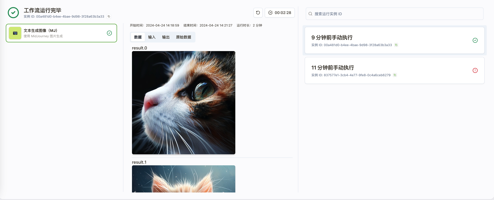

<div align="center">

# Monkey Tools for Midjourney<!-- omit in toc -->

[](http://www.apache.org/licenses/LICENSE-2.0)
[](https://github.com/inf-monkeys/monkey-tools-midjourney/stargazers)
[](https://github.com/inf-monkeys/monkey-tools-midjourney)

<h3 align="center">Midjourney 画图</h3>

</div>

## 目录<!-- omit in toc -->

- [简介](#简介)
- [配置项](#配置项)
- [运行](#运行)
  - [通过源码运行](#通过源码运行)
- [在 Monkeys 平台导入此工具](#在-monkeys-平台导入此工具)
  - [方式一: 通过控制台](#方式一-通过控制台)
  - [方式二: 通过配置文件](#方式二-通过配置文件)

## 简介

此工具可用来调用 Midjourney 接口画图。目前已支持的 Midjourney Server:

- [x] [GOAPI](https://www.goapi.ai/midjourney-api)
- [ ] 官方 Midjourney Server



## 配置项

在项目路径下新建 `config.yaml` 文件，示例如下：

```yaml
server:
  port: 3005

goapi:
  baseUrl: https://api.goapi.ai
  apikey: xxxxxx

s3:
  accessKeyId: xxxxxxxx
  secretAccessKey: xxxxxxxx
  endpoint: xxxxxxxx
  region: xxxxxxxx
  bucket: xxxxxxxx
  publicAccessUrl: xxxxxxxx
```

参数含义：

- `server`:
  - `port`: 运行端口，请确保不要和本地的服务冲突。
- `goapi`:
  - `baseUrl`: GoAPI BaseURL 可选，在使用镜像地址时，需要配置此项。
  - `apikey`: 请前往 [https://www.goapi.ai/](https://www.goapi.ai/) 获取。
- `s3`: 由于需要将生成的图片上传到 OSS 才能被工作流使用，所以需要配置 S3 相关配置。

## 运行

### 通过源码运行

1. 克隆 GitHub 仓库

   ```sh
   git clone https://github.com/inf-monkeys/monkey-tools-midjourney.git
   ```

2. 安装 Node modules

   ```sh
   yarn
   ```

3. 安装 sharp 包（用于切分图像）

   ```sh
   yarn add sharp --ignore-engines
   ```

4. 启动 server:

   > 此项目默认运行在 8001 端口.

   ```sh
   yarn start:debug
   ```

## 在 Monkeys 平台导入此工具

### 方式一: 通过控制台

在控制台的 **执行类工具** 菜单，点击右上角的导入按钮，输入此工具的 `manifest.json` 地址，点击确定。

```
http://127.0.0.1:8001/manifest.json
```

> 可按照你的具体情况做修改。

### 方式二: 通过配置文件

将此工具的 `manifest.json` 地址注册到 `monkeys` 服务的 `config.yaml` 中 `tools` 数组中:

```yaml
tools:
  - name: midjourney
    manifestUrl: http://127.0.0.1:3005/manifest.json
```

之后重启服务。
